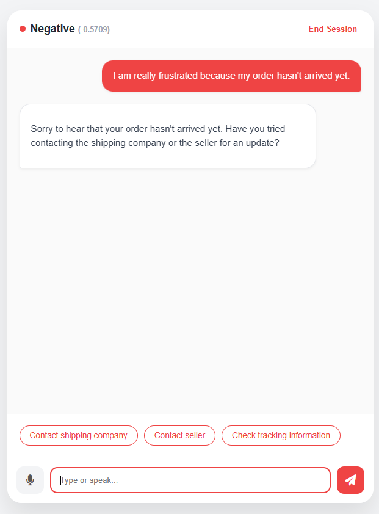
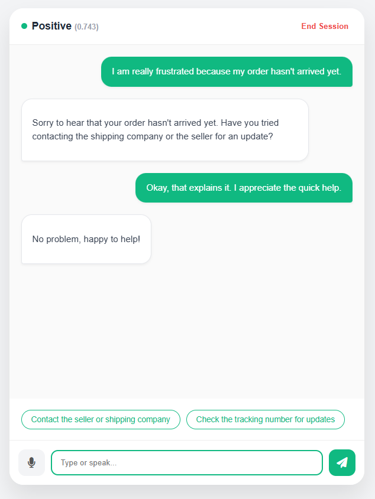
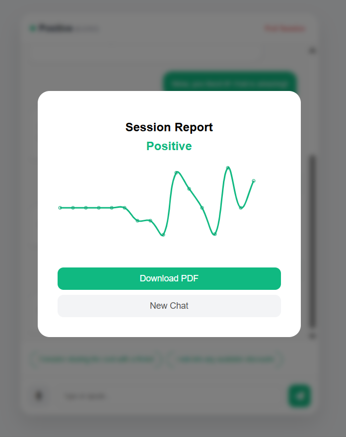

# 🤖 Sentinel AI: Voice-Enabled Sentiment Assistant
### Enterprise-Grade Conversational Intelligence Platform

## 📋 Overview
Sentinel AI is a robust, full-stack chatbot designed to perform real-time sentiment analysis and context-aware conversational responses. It bridges the gap between rule-based NLP (VADER) and Generative AI (Llama 3 via Groq LPU).

The system currently runs as a monolithic prototype featuring **Voice-to-Voice interaction**, **Persistent Memory**, and **Enterprise Reporting**.

---

## 📸 Project Demo

| **Voice-Enabled Interface** | **Smart Sentiment Analysis** |
|:---:|:---:|
|    *Real-time sentiment scoring and Chameleon UI* |    *Voice interaction with active listening state* |

| **Analytics Dashboard** | **Official Report** |
|:---:|:---:|
|    *Session trend analysis graph* | [**📄 View Sample Report PDF**](screenshots/Report.pdf)   *Click to view generated transcript* |

---

## ✨ Implemented Features (Current Status)

### 1. Hybrid Intelligence Engine
* **Layer 1 (Speed):** Uses **NLTK VADER** for immediate emotional scoring (<10ms).
* **Layer 2 (Cognition):** Uses **Llama 3.1 (8B)** for empathetic, context-aware reasoning.

### 2. Advanced User Experience
* **🎙️ Voice Interaction:** Full integration of the **Web Speech API** for Speech-to-Text (STT) and Text-to-Speech (TTS).
* **🎭 Chameleon UI:** The interface dynamically changes color themes (Green/Red/Blue) based on real-time sentiment scores.
* **⚡ Smart Suggestions:** The AI enforces structured JSON output to predict and render clickable "Quick Reply" chips.

### 3. Enterprise Features
* **📊 PDF Reporting:** One-click generation of official transcripts, including timestamped logs and sentiment trend graphs (using `jsPDF` and `Chart.js`).
* **💾 Persistent Memory:** Full Database Schema stores `Conversation` sessions and `Message` logs, persisting data across server restarts.
* **⚙️ Admin Dashboard:** Fully accessible Django Admin panel for auditing chat logs.

---

## 🛠️ Chosen Technologies
- **Backend:** Django 5.0 (Session management, API routing)
- **AI Engine:** LangChain + Groq (Llama-3.1-8b-instant)
- **Sentiment Logic:** NLTK VADER (Valence Aware Dictionary and sEntiment Reasoner)
- **Frontend:** HTML5, CSS3, JavaScript (Fetch API, Chart.js, jsPDF)

## 🧠 Explanation of Sentiment Logic
The application uses a dual-layer approach:
1. **Statement-Level (Tier 2):** Every incoming message is scored by VADER. The `compound` score determines if the text is Positive (>0.05), Negative (<-0.05), or Neutral. This score is injected into the System Prompt, instructing Llama 3 to adapt its tone (e.g., "De-escalate" if negative).
2. **Conversation-Level (Tier 1):** We track the running average of all compound scores. At the end of the session, this average determines the "Overall Conversation Sentiment" and generates the mood trend graph.

## ✅ Status of Tier 2 Implementation
**Completed and Exceeded.**
- Each message displays its individual sentiment score in real-time.
- The UI provides an optional "Mood Trend" graph upon ending the chat.

---

## 🔮 Future Architecture & Scalability Roadmap
*While the current prototype runs on a development server, the following architecture is designed for scaling to 10,000+ concurrent users with Enterprise Knowledge integration.*

### Phase 1: Knowledge Integration (RAG Pipeline)
* **Current:** The LLM relies on pre-trained knowledge.
* **Future Implementation:** Implement **Retrieval-Augmented Generation (RAG)**.
    * *Vector DB:* Integrate **Pinecone** or **FAISS** to store company documents (PDFs, Wikis).
    * *Embedding Model:* Use `all-MiniLM-L6-v2` to vectorize user queries.
    * *Outcome:* The bot will be able to answer specific domain questions (e.g., "What is our refund policy?") by retrieving relevant context before generating an answer.

### Phase 2: App Server (Concurrency)
* **Current:** `python manage.py runserver` (Single-threaded).
* **Future Implementation:** Migrate to **Gunicorn** (WSGI) behind an **Nginx** reverse proxy to handle concurrent request forking.

### Phase 3: Data Layer (Throughput)
* **Current:** SQLite (File-based locking).
* **Future Implementation:** Migrate to **PostgreSQL**. This enables **Row-Level Locking**, allowing thousands of users to write messages simultaneously without "Database Locked" errors.

### Phase 4: Asynchronous Task Queue
* **Current:** Synchronous API calls.
* **Future Implementation:** Implement **Celery + Redis**.
    * *Flow:* User sends message -> Server accepts (202 Accepted) -> **Celery Worker** processes LLM request in background -> Server pushes result via WebSockets.

---

## 🏃‍♂️ How to Run

### Option 1: Standard
1. Clone the repo.
2. Install dependencies: `pip install -r requirements.txt`
3. Create a `.env` file with `GROQ_API_KEY=your_key`.
4. Run migrations: `python manage.py migrate`
5. Start server: `python manage.py runserver`

### Option 2: Docker
1. `docker build -t sentiment-bot .`
2. `docker run -p 8000:8000 --env-file .env sentiment-bot`

## 🧪 Tests
Unit tests are included for API endpoints and sentiment logic.
Run via: `python manage.py test`